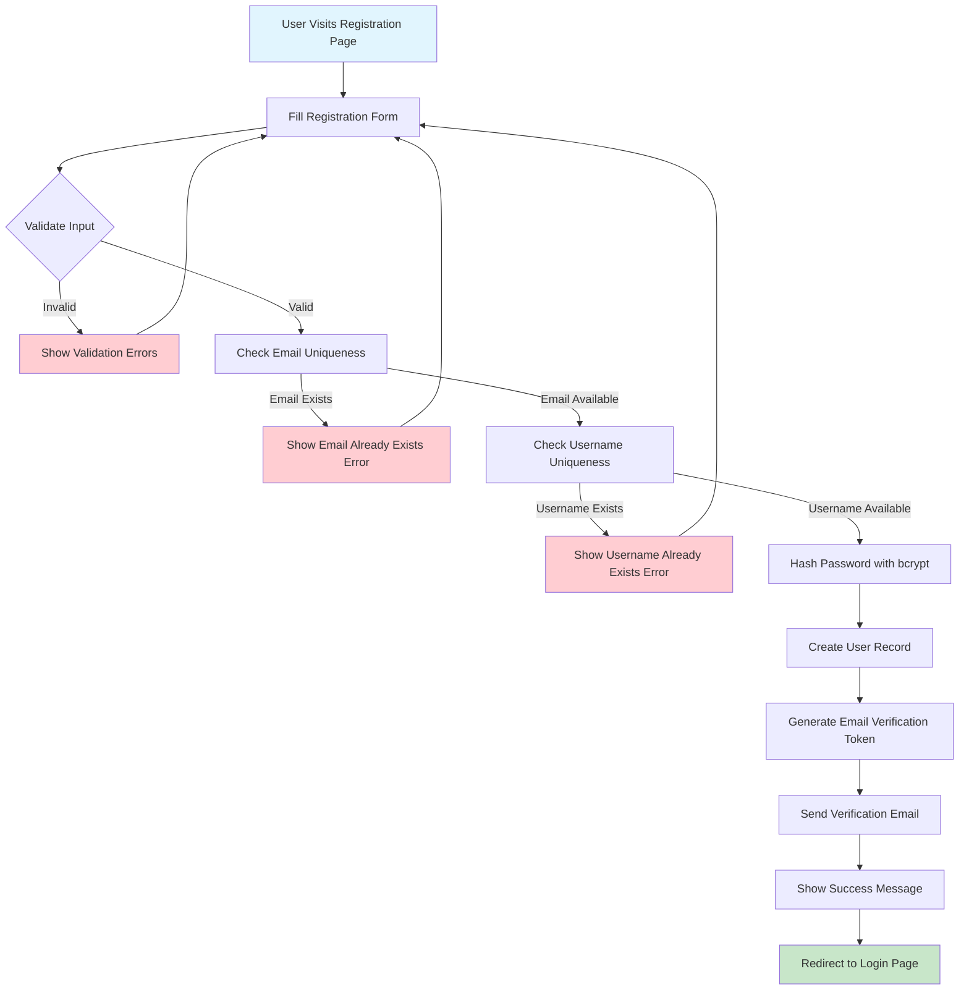
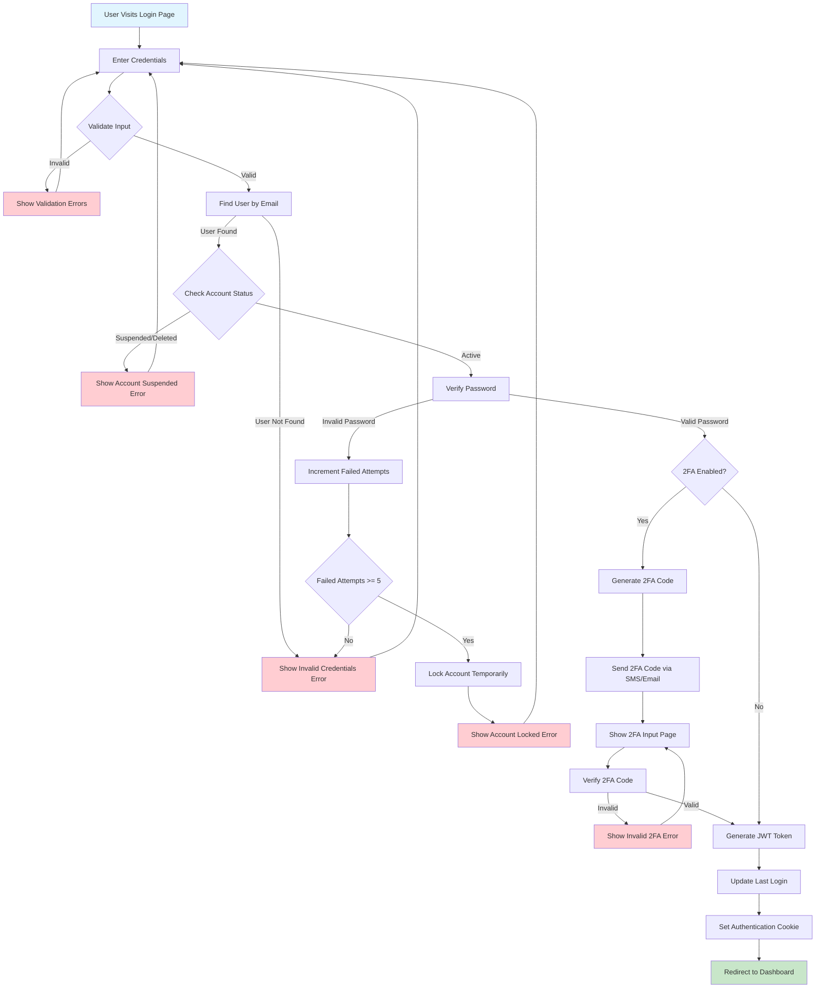
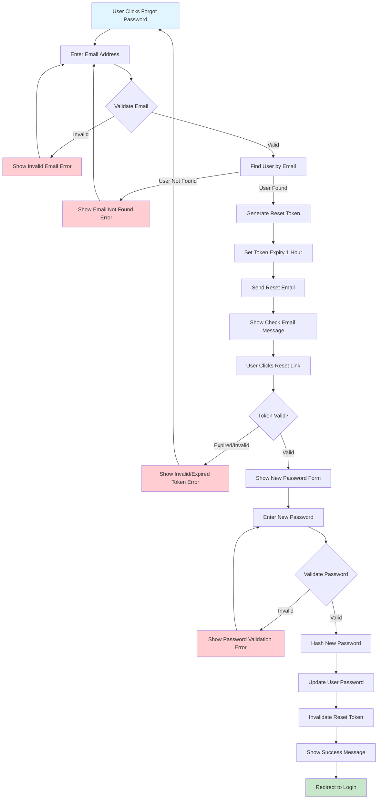
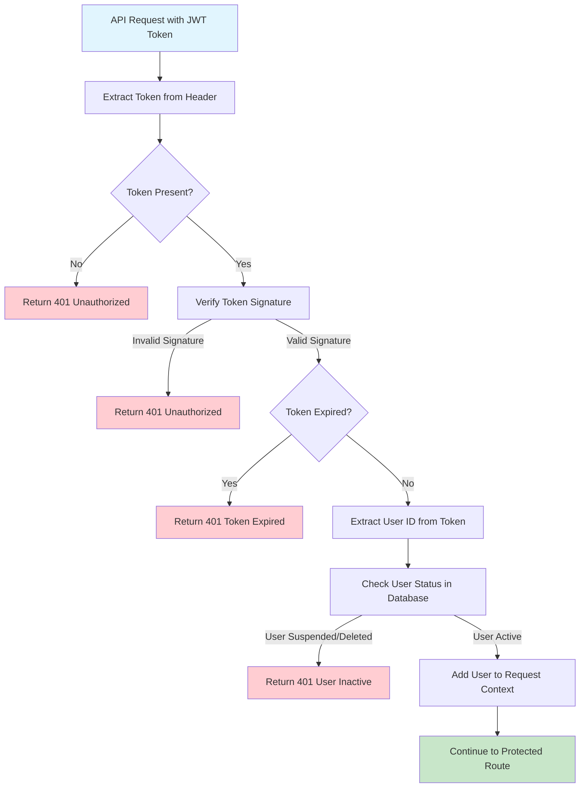
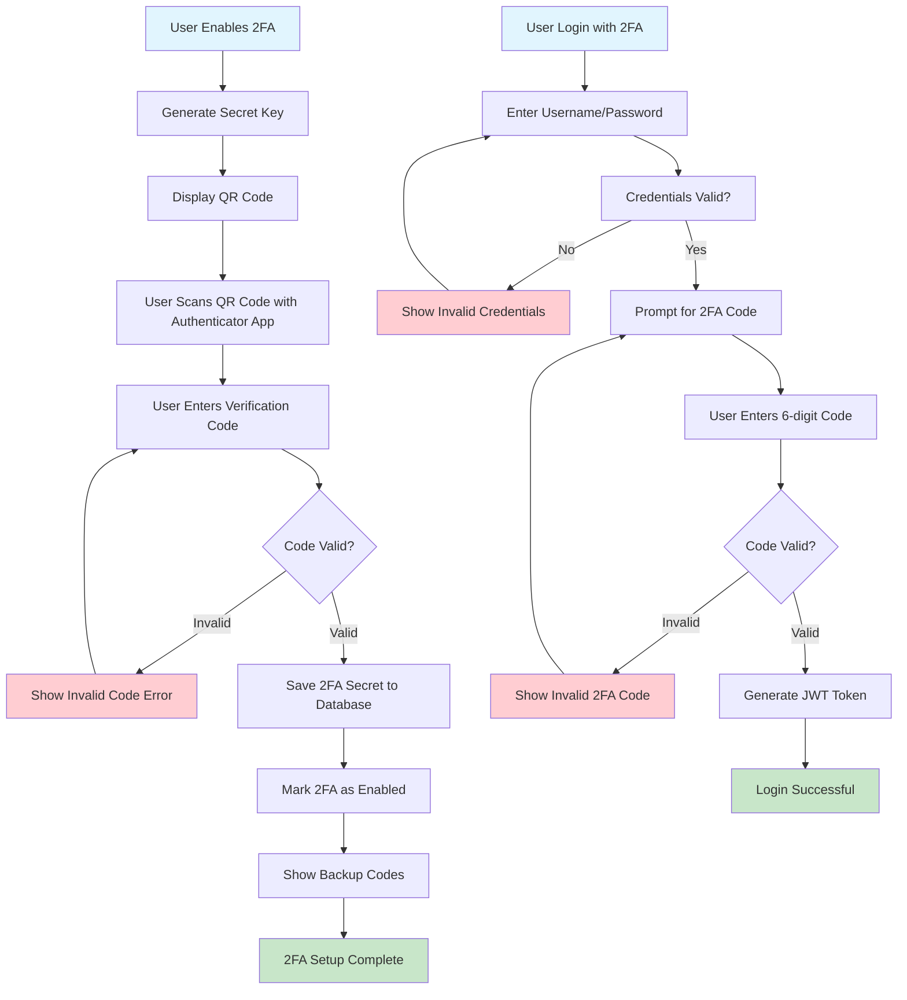
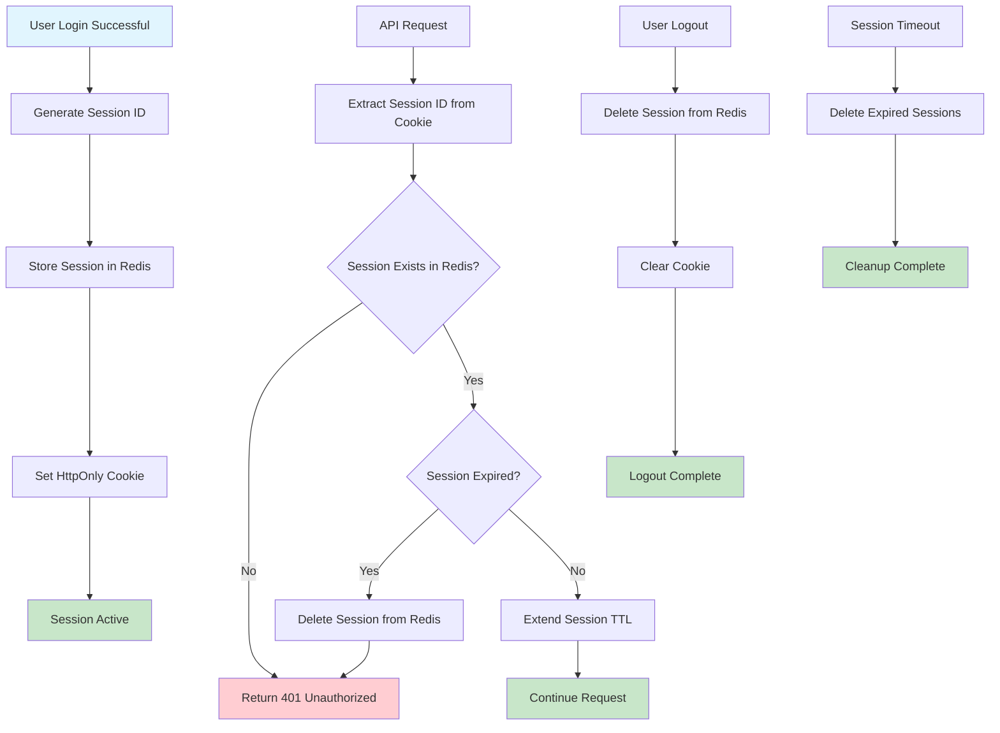

# Authentication System Flowchart

## 🔐 User Registration Flow



## 🔑 User Login Flow



## 🔄 Password Reset Flow



## 🛡️ JWT Token Validation Flow



## 🔐 Two-Factor Authentication Flow



## 🔒 Session Management Flow



## 📊 Security Algorithms

### Password Hashing Algorithm
```typescript
// bcrypt with salt rounds = 12
const saltRounds = 12;
const hashedPassword = await bcrypt.hash(password, saltRounds);

// Password validation regex
const passwordRegex = /^(?=.*[a-z])(?=.*[A-Z])(?=.*\d)(?=.*[@$!%*?&])[A-Za-z\d@$!%*?&]{8,}$/;
```

### JWT Token Structure
```typescript
interface JWTPayload {
  userId: string;
  email: string;
  username: string;
  role: 'user' | 'creator' | 'admin';
  iat: number;
  exp: number;
  sessionId: string;
}
```

### Rate Limiting Algorithm
```typescript
// Token bucket algorithm for rate limiting
const rateLimitConfig = {
  windowMs: 15 * 60 * 1000, // 15 minutes
  max: 100, // limit each IP to 100 requests per windowMs
  standardHeaders: true,
  legacyHeaders: false,
};
```

---

*This authentication system provides comprehensive security features including registration, login, password reset, 2FA, JWT validation, and session management with proper security measures and rate limiting.*
