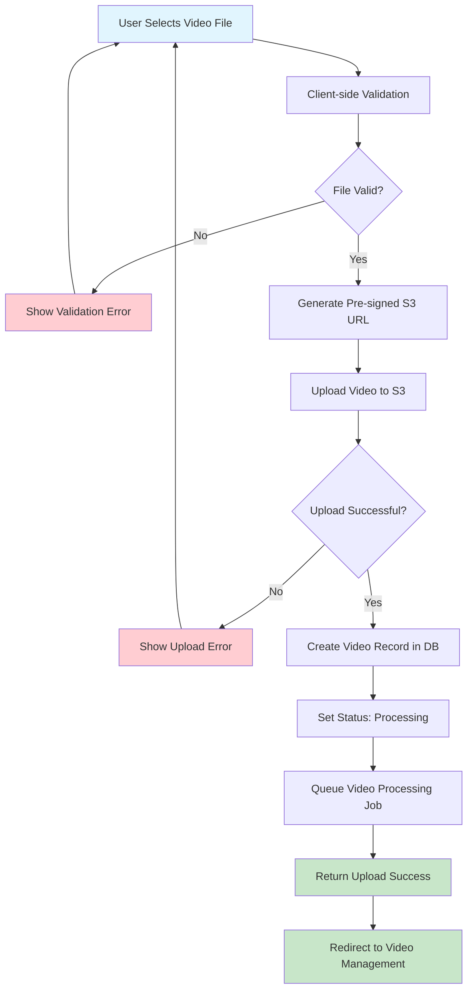
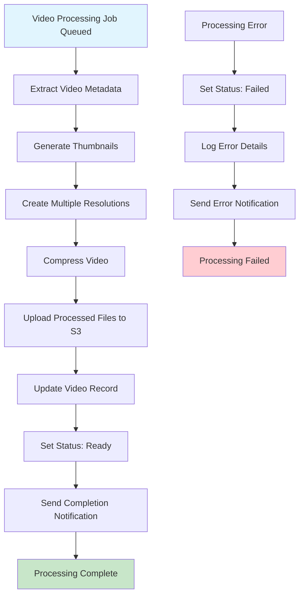
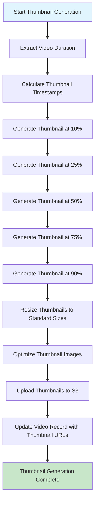
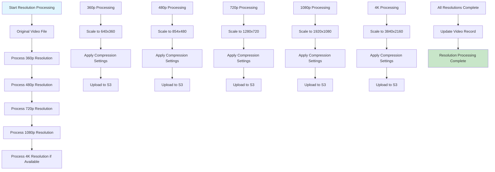
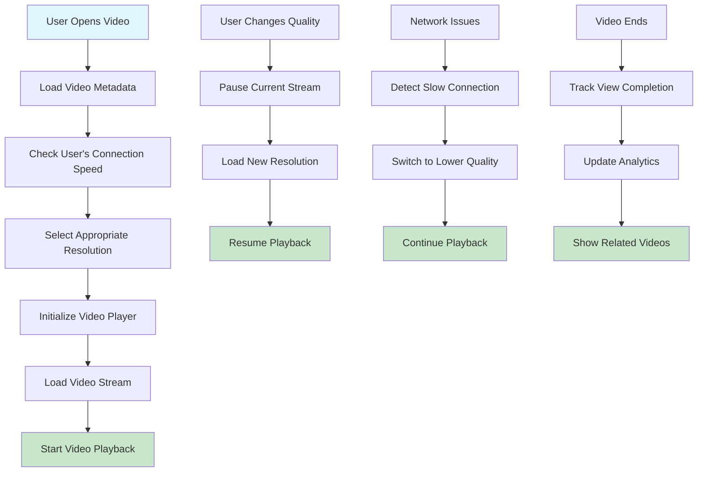
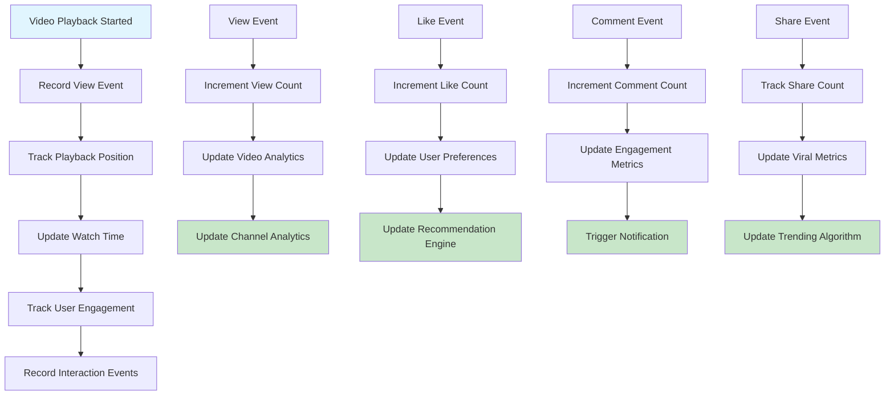
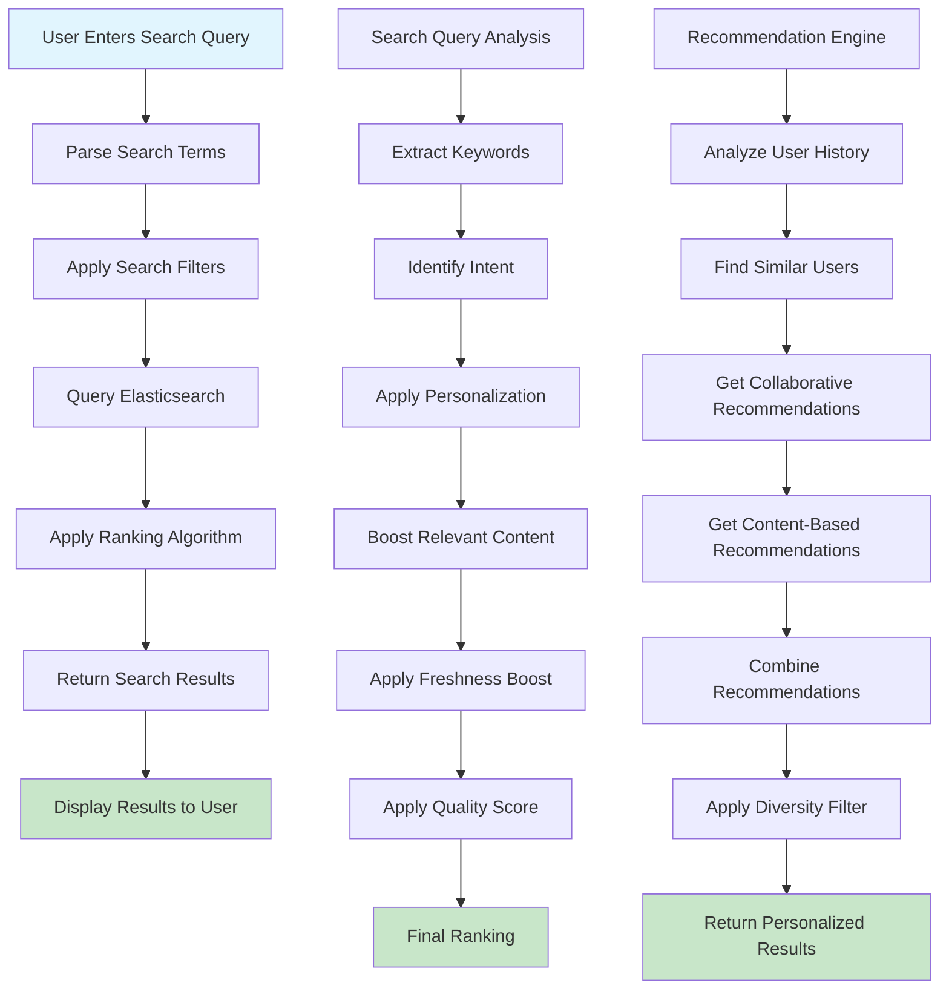
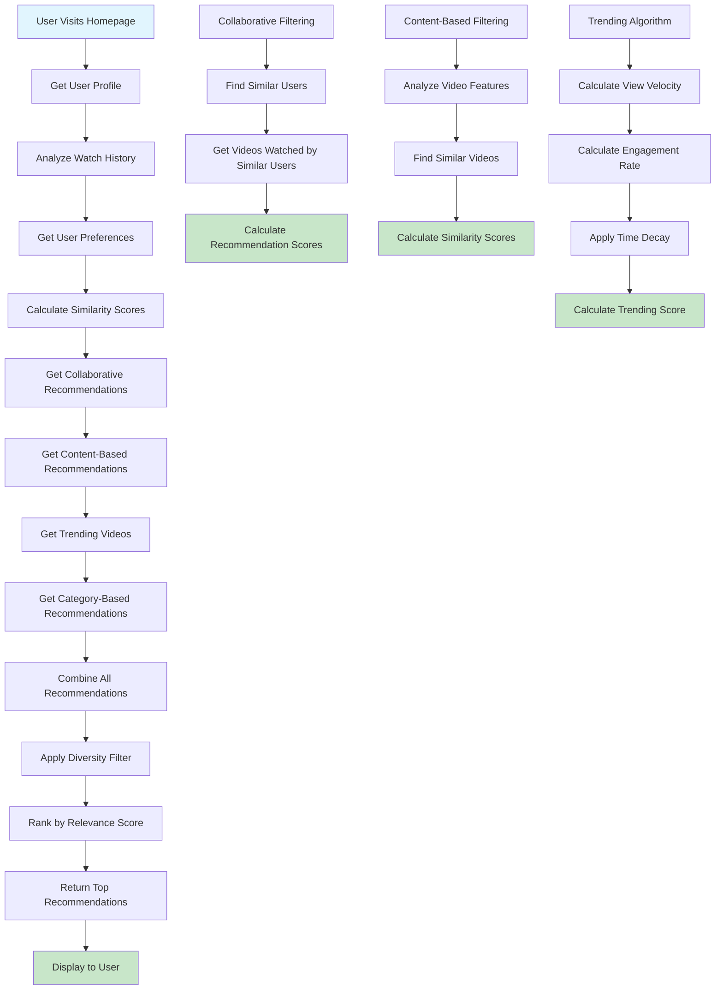

# Video Processing Pipeline Flowchart

## 🎥 Video Upload Flow



## 🔄 Video Processing Pipeline



## 🖼️ Thumbnail Generation Flow



## 📱 Multi-Resolution Processing



## 🎬 Video Player Flow



## 📊 Video Analytics Tracking



## 🔍 Video Search & Discovery Flow



## 🎯 Recommendation Algorithm Flow



## 🔧 Technical Implementation Details

### Video Processing Algorithm
```typescript
interface VideoProcessingJob {
  videoId: string;
  s3Key: string;
  resolutions: string[];
  thumbnailCount: number;
  metadata: VideoMetadata;
}

const processVideo = async (job: VideoProcessingJob) => {
  const resolutions = ['360p', '480p', '720p', '1080p'];
  
  // Process each resolution
  for (const resolution of resolutions) {
    await ffmpeg()
      .input(`s3://bucket/${job.s3Key}`)
      .outputOptions([
        `-vf scale=${getResolutionDimensions(resolution)}`,
        '-c:v libx264',
        '-c:a aac',
        '-preset fast',
        '-crf 23',
        '-maxrate 2M',
        '-bufsize 4M'
      ])
      .output(`s3://bucket/${job.videoId}/${resolution}.mp4`)
      .run();
  }
  
  // Generate thumbnails
  await generateThumbnails(job.videoId, job.thumbnailCount);
  
  // Update video status
  await updateVideoStatus(job.videoId, 'ready');
};
```

### Adaptive Streaming Algorithm
```typescript
const selectOptimalResolution = (connectionSpeed: number, deviceCapability: string) => {
  const resolutionMap = {
    '4K': { minSpeed: 25000, device: 'desktop' },
    '1080p': { minSpeed: 5000, device: 'any' },
    '720p': { minSpeed: 2500, device: 'any' },
    '480p': { minSpeed: 1000, device: 'any' },
    '360p': { minSpeed: 500, device: 'any' }
  };
  
  for (const [resolution, requirements] of Object.entries(resolutionMap)) {
    if (connectionSpeed >= requirements.minSpeed && 
        (requirements.device === 'any' || deviceCapability === requirements.device)) {
      return resolution;
    }
  }
  
  return '360p'; // Fallback
};
```

### Recommendation Scoring Algorithm
```typescript
const calculateRecommendationScore = (
  userProfile: UserProfile,
  video: Video,
  userHistory: WatchHistory[]
): number => {
  const weights = {
    collaborative: 0.4,
    contentBased: 0.3,
    trending: 0.2,
    diversity: 0.1
  };
  
  const scores = {
    collaborative: calculateCollaborativeScore(userProfile, video),
    contentBased: calculateContentBasedScore(userHistory, video),
    trending: calculateTrendingScore(video),
    diversity: calculateDiversityScore(userProfile, video)
  };
  
  return Object.entries(scores).reduce(
    (total, [key, score]) => total + (score * weights[key]),
    0
  );
};
```

---

*This video processing pipeline provides a comprehensive system for handling video uploads, processing, streaming, analytics, and recommendations with scalable architecture and efficient algorithms.*
